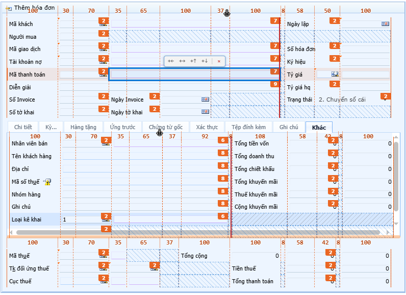
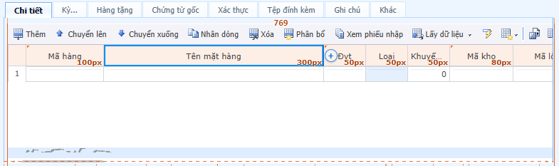
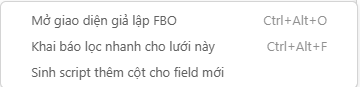
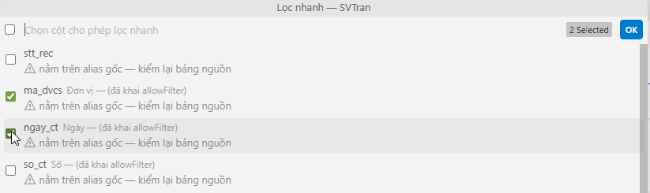
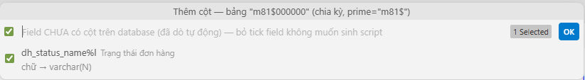
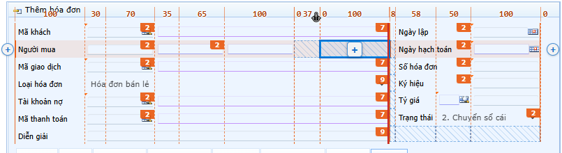
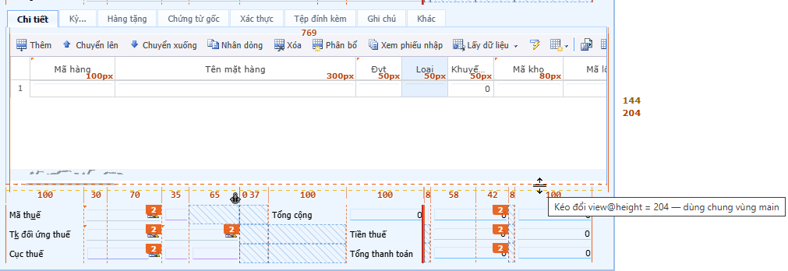

# FBO Designer

FBO Designer là extension cho Cursor giúp thiết kế form FBO ngay trong IDE: mở file controller, nhìn layout qua **Blueprint**, kéo thả control, chỉnh biên cột, rồi sửa XML mà không rời ide.

## Tại sao nên dùng

- Thiết kế form FBO trực tiếp trên file `Dir` / `Filter` / `Grid`
- Blueprint mặc định: thước px, slot, `colspan`, `split`, `anchor` đọc layout từ XML thuần
- Kéo thả, thêm hàng / field / cột, đổi chỗ control
- Sinh script khai báo lọc nhanh và thêm cột database
- Ctrl+click (hoặc double click) nhảy đúng file / dòng khai báo entity và Include

## Tính năng chính

### 1. Blueprint (layout + debug tài nguyên)

Blueprint là lớp thiết kế mặc định trên form đang mở:

- Thước đo pixel, khung slot, số `colspan`, vạch `split`, `anchor`, `move`, `drag` and `drop`
- Form có `view@split` / `category@split` render đúng runtime
- Chọn ô để xem khai báo field, file nguồn và nơi khai báo
- Xem stylesheet đang nạp, ảnh đang dùng (kích thước file / render / sprite)
- Nạp lại resource khi cần làm mới cache hoặc kiểm tra lỗi hình ảnh

*Blueprint trên form chứng từ: thước cột, slot trống, nhãn* `colspan` *và vùng split.*

*Tab và vùng nội dung — neo / split đọc được ngay trên design.*

*Lưới chi tiết: bề rộng cột (px) và nút* `(+)` *chèn cột giữa các header.*

### 2. Tạo script: khai báo lọc và thêm cột

Hai lệnh riêng — sinh script chạy trên database khách, nặng hơn thao tác kéo thả trên design:

| Lệnh                                   | Phím tắt     | Việc làm                                                                                          |
| -------------------------------------- | ------------ | ------------------------------------------------------------------------------------------------- |
| **Mở giao diện giả lập FBO**           | `Ctrl+Alt+O` | Mở panel designer bám theo file controller đang active                                            |
| **Khai báo lọc nhanh cho lưới này**    | `Ctrl+Alt+F` | Bật `allowFilter` / `<query>` trên XML lưới (nếu thiếu), sinh SQL xoá–nạp lại `sysfilterdeclares` |
| **Sinh script thêm cột cho field mới** | `Ctrl+Alt+C` | So field trên form với schema, sinh SQL thêm cột cho field chưa có trên bảng                      |

Mở file lưới / form FBO → chuột phải → **FBO Designer**, hoặc Command Palette.

*Menu chuột phải trên file* `.xml` */* `.f`*: mở designer, khai báo lọc, sinh script thêm cột.*

**Khai báo lọc nhanh**

1. Mở file trong `App_Data\Controllers\Grid`
2. Chạy lệnh hoặc `Ctrl+Alt+F`
3. Chọn cột cần lọc; chấp nhận sửa XML nếu thiếu `allowFilter` / `%Control.Filter;`
4. Chạy script SQL trên database `sys` của khách theo đúng controller
5. Dòng chưa rõ bảng nguồn được đánh dấu, không che điểm chưa biết

*Hộp thoại chọn cột lọc nhanh — tick cột cần bật, dòng chưa rõ bảng nguồn có cảnh báo.*

**Sinh script thêm cột**

Chạy **Sinh script thêm cột cho field mới** trên form/lưới: extension dò field chưa có cột trên database, tick field cần sinh SQL, rồi mở script để chạy trên DB khách.

*Chọn field thiếu cột trên bảng (vd. chia kỳ) — bỏ tick field không muốn sinh script.*

- Giải `&Entity;` / `Config`: biết hàng đến từ file nào
- Ctrl+click hoặc double click mở đúng chỗ khai báo
- Sửa control từ entity: hỏi ghi vào file gốc hay phân giải inline (`entityEditTarget`)

## Kích hoạt License

Mọi tính năng Designer chỉ chạy khi đã có **License Key** hợp lệ trên máy của bạn.

### 1. Lấy Machine ID

1. Cài / mở extension **FBO Designer**.
2. Mở **Settings** (`Ctrl+,`) → gõ `FBO Designer` hoặc `machineId`.
3. Copy giá trị **Machine Id** (chuỗi hex, ví dụ `aec330dc91f04a326cf470d5d2ddad61`).

Gửi **Machine Id** + tên công ty / bộ phận cho người cấp license (admin nội bộ).

### 2. Nhận và dán License Key

1. Admin phát hành key (thường dạng `FBO1....`, hạn dùng theo thỏa thuận).
2. Trong Settings → **FBO Designer** → **License Key**, dán toàn bộ key rồi Enter / lưu.
3. Extension kích hoạt offline: không cần gọi server khi dùng hàng ngày.

Khi thành công, **License Key** vẫn hiện trong Settings để bạn đối chiếu. Xóa hết ô License Key = hủy kích hoạt trên máy đó.

### 3. Khi bị khóa

| Hiện tượng | Việc cần làm |
| ---------- | ------------ |
| Thông báo cần License / trang “đang khoá” | Dán key vào Settings như trên |
| License hết hạn | Xin admin key mới, dán đè lên key cũ |
| Machine ID không khớp | Gửi đúng Machine Id máy hiện tại để admin cấp lại |

Machine Id gắn với máy; đổi máy / cài lại Windows thường cần key mới (hoặc key đã gồm Machine Id máy mới).

## Cách dùng nhanh

### 1. Mở bằng chuột phải hoặc lệnh

1. Mở file controller trong `App_Data/Controllers/Dir`, `Filter` hoặc `Grid` (`.xml` / `.f`).
2. Chuột phải → **FBO Designer** → **Mở giao diện giả lập FBO**, hoặc Command Palette / `Ctrl+Alt+O`.
3. Panel luôn render theo file đang active: sửa XML bên trái, form bên phải.

### 2. Kéo thả, thêm hàng / cột / control, swap

*Rê chuột lên hàng →* `+` *mép ngoài thêm hàng; chọn slot trống →* `(+)` *thêm field.*

*Kéo mép dưới tab để đổi* `view@height`*; vùng main dùng chung chiều cao.*

**Dời và đổi chỗ (swap)**

- Kéo control sang **slot trống** → dời.
- Kéo lên **control khác cùng hàng** → đổi chỗ (swap token, giữ pattern/slot — kể cả khác `colspan`).

**Thêm hàng**

- Rê chuột lên hàng form → nút `+` ngoài mép (một nút, hoặc hai nút khi vùng có `split`) → thêm hàng trống bên dưới.
- Form `split`: `+` trái / `+` phải chèn slot trống một nửa và **dồn nửa kia** của các hàng phía dưới lên (tới trước hàng nhúng lưới Detail), nửa còn lại không bị đẩy xuống dòng trống thừa.
- Tab chỉ chứa lưới Detail không hiện `+` thêm hàng form.
- Hàng / nửa hàng toàn slot trống giữ chiều cao gần hàng có ô nhập (~24px).

**Thêm control (field)**

- Bấm slot trống (ô gạch chéo) → `(+)` giữa ô → thêm field đúng chỗ đó.

**Thêm / chỉnh cột lưới**

- Trên header lưới: nút `(+)` giữa các cột để chèn cột mới tại vị trí đó.

**Tách / gộp biên cột form (**`Tách` **/** `◄Gộp` **/** `Gộp►`**)**

Bấm con số px trên dải thước phía trên bảng. Thanh lệnh:

- `Tách` — chia cột đang chọn thành hai (hỏi bề rộng; mặc định chia đôi, tổng giữ nguyên).
- `◄Gộp` / `Gộp►` — gộp với cột liền trái hoặc liền phải; bề rộng mới = tổng hai cột cũ.

Đây **không** phải tay cầm xanh ở mép ô. Tay cầm xanh đổi số cột **một** control đang trải (trong danh sách biên sẵn có), chỉ ảnh hưởng một hàng. Ba nút trên thước đổi **danh sách biên dùng chung** — mọi hàng đọc cùng `<item value="100, 60, 90">` (header, footer, tab không có `columns` riêng, kể cả Include) đều được viết lại. Designer báo rõ số hàng / số file trước khi ghi.

Từ chối thay vì đoán:

- Gộp hai cột đang giữ hai control khác nhau — bỏ một control trước.
- Gộp đúng vào vạch `split` đang trỏ — đổi `split` trước.

`anchor` và `split` được dời theo chỉ số cột ở mọi trường hợp còn lại.

**Xóa**

- `Delete` xóa control trên form.
- `Shift+Delete` xóa luôn khai báo `<field>` khi được hỗ trợ.

## Ý nghĩa màu trên design

- Cam: mốc đo layout, số px blueprint, nhãn `colspan`
- Xanh dương: vùng đang chọn, ô trống thao tác được, đường/khung phụ trợ
- Xám: ô trống từ Include / nguồn ngoài thường không sửa như ô nội bộ
- Đỏ: vùng chia tách, thao tác xóa, hoặc vị trí kéo không hợp lệ
- Xanh lá: vị trí hợp lệ khi đang dời control
- Nền cam nhạt: hàng đang chọn

Một số màu còn bám theme (dark/light) nên nhìn thực tế có thể hơi khác.

## Biểu tượng và nút thao tác

| Ký hiệu                  | Việc                                                                                                                                                                                                            |
| ------------------------ | --------------------------------------------------------------------------------------------------------------------------------------------------------------------------------------------------------------- |
| `(+)`                    | Viền form: thêm dòng · Slot trống: thêm control · Grid: thêm cột                                                                                                                                                |
| Delete / Shift+Delete    | Xóa control / kèm `<field>`                                                                                                                                                                                     |
| Drag / drop              | Di dời control; kéo lên control cùng hàng = swap                                                                                                                                                                |
| `⚓`                      | Mỏ neo (`view@anchor`) — kéo ngang để đổi cột neo                                                                                                                                                               |
| `┃` đỏ (`split`)         | Vạch đỏ dọc — ranh giới `view@split` / `category@split`; kéo ngang để dời chỗ chia hai FormTable                                                                                                                |
| `Tách` / `◄Gộp` / `Gộp►` | Bấm số px trên thước form: tách một cột biên thành hai, hoặc gộp với cột liền trái / phải (đổi danh sách biên dùng chung cả vùng)                                                                               |
| `cursor resize`          | Hai mép ô đang chọn, kéo để gộp/tách **một** control (`colspan`), không đổi list px vùng · `Line -- (cam)` ở main thay đổi chiều cao tab (field@rows) · `Line -- (đỏ)` ở main thay đổi chiều cao main (`view@height`) |

## Đóng góp

Báo lỗi, đề xuất thiết kế gửi trực tiếp cho **NGUYENTDH**