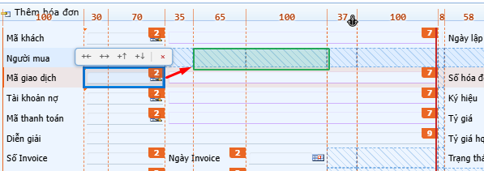
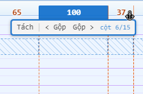
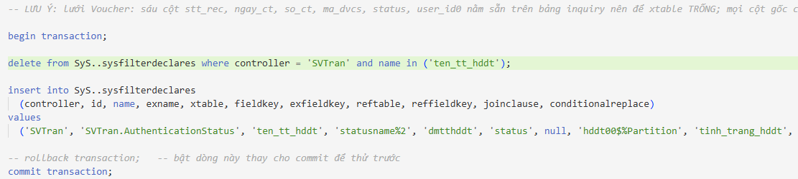
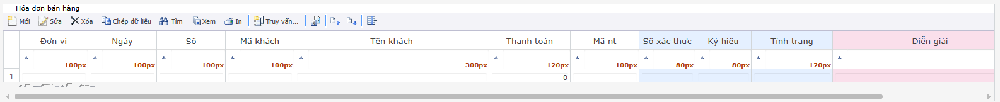
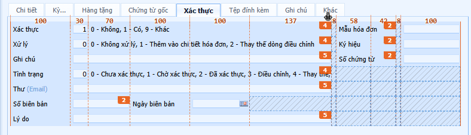

# FBO Designer

FBO Designer là extension cho VS Code giúp bạn xem trước, kiểm tra và chỉnh sửa giao diện form FBO trực tiếp trong IDE, thay vì phải hình dung layout từ file XML bằng mắt.

Dự án này tập trung vào trải nghiệm làm việc thực tế của lập trình viên: mở file FBO, nhìn form render như runtime, kiểm tra vùng layout, nhấn nhanh vào control, xác định lỗi CSS và tài nguyên, rồi sửa ngay trên XML mà không rời khỏi môi trường làm việc hiện tại.

## Tại sao nên dùng FBO Designer?

- Xem form FBO ngay trong VS Code hoặc Cursor
- Giảm thời gian đoán layout từ XML thuần
- Kiểm tra thiết kế gần với runtime hơn là mô phỏng tay
- Theo dõi tài nguyên, stylesheet và hình ảnh đang được load
- Hỗ trợ thao tác nhanh với filter, entity và các thành phần trong form
- Làm việc như một công cụ thiết kế nội bộ, không cần chuyển qua môi trường khác

## Tính năng chính

### 1. Preview form trực tiếp

- Mở form từ file XML đang active hoặc từ một file cụ thể
- Dùng chế độ xem theo document đang mở hoặc panel bám theo file đang làm việc
- Kiểm tra form, grid và cấu trúc layout ngay trong trình soạn thảo

### 2. Blueprint và kiểm tra hình học

- Hiển thị thước đo pixel, khung slot và cấu trúc layout
- Giúp xác định khoảng cách, chiều rộng, vị trí control và yếu tố bố cục
- Dễ phát hiện sai lệch giữa XML và render thực tế

### 3. Debug tài nguyên và stylesheet

- Xem stylesheet đang được nạp và nguồn gốc của từng rule
- Kiểm tra ảnh đang sử dụng, kích thước file, kích thước render và sprite
- Cung cấp thông tin chi tiết của ô đang chọn: class, offset, HTML, file nguồn và vị trí
- Nạp lại resource khi cần làm mới cache hoặc phát hiện lỗi hình ảnh

### 4. Hỗ trợ filter và logic nghiệp vụ

- Sinh khai báo filter nhanh cho grid theo controller, alias và cặp join trong câu Finding
- Cho phép chọn các cột cần bật lọc nhanh, tự gắn `allowFilter` và `<query>` vào XML đúng vị trí
- Tạo script SQL chuẩn để xoá và nạp lại `sysfilterdeclares` theo controller cùng tên field
- Hỗ trợ kiểm tra dữ liệu đối với cấu trúc query và form điều kiện tìm kiếm

#### Khai báo lọc nhanh

- Mở file grid FBO trong `App_Data\Controllers\Grid`
- Chạy lệnh `FBO Designer: Khai báo lọc nhanh cho lưới này` hoặc dùng phím tắt `Ctrl+Alt+F`
- Chọn các cột cần bật filter và chấp nhận sửa XML nếu extension phát hiện thiếu `allowFilter` / `%Control.Filter;`
- Xem script SQL được mở ở tab riêng, rồi đọc và chạy trên database `sys` của khách theo đúng controller
- Nếu có dòng cần xem lại, extension đánh dấu rõ và không che giấu điểm chưa biết bảng nguồn

### 5. Quản lý entity và include

- Giải quyết tham chiếu entity trong các file FBO
- Nhảy đúng nơi khai báo khi click vào item liên quan
- Dễ theo dõi và sửa các thành phần dùng chung trên nhiều controller

### 6. Đóng gói và vận hành linh hoạt

- Có thể đóng gói thành file .vsix để cài trên VS Code hoặc Cursor
- Không phụ thuộc vào npm install trong môi trường runtime của dự án
- Dễ triển khai cho nhóm phát triển hoặc môi trường nội bộ

## Cập nhật gần đây

- Render đã được gộp nhịp để giảm lag khi một thao tác phát sinh nhiều thay đổi liên tiếp.
- Includes và dữ liệu bung entity được nhớ theo mtime để không đọc lại và không bung lại vô ích mỗi lần render.
- Cấu hình Grid/Config/Initialize.xml được memo hóa theo toàn bộ tập file đã tham gia vào kết quả.
- Custom editor và preview panel đều chỉ gửi dữ liệu an toàn qua webview, không đẩy `model` và `expanded` qua `postMessage`.
- Blueprint trên design có thêm lớp tô màu và biểu tượng rõ hơn để đọc layout nhanh hơn.

## Cách dùng nhanh

### 1. Mở đúng loại file

- Mở file controller FBO trong `App_Data/Controllers/Dir`, `Filter` hoặc `Grid`.
- File ngoài các thư mục này sẽ không có preview designer.

### 2. Mở designer

- Dùng F5 để chạy extension trong VS Code.
- Hoặc mở lệnh tương ứng từ Command Palette để bật designer hoặc preview panel.

### 3. Bật Blueprint khi cần đo layout

- Blueprint hiển thị thước px, đường cột, ô trống, số `colspan`, mỏ neo và các tay cầm kéo.
- Khi chỉ cần xem form, có thể tắt blueprint để giao diện gọn hơn.

### 4. Sửa trực tiếp trên design

- Chọn control để hiện thanh thao tác nổi.
- Kéo các mép và tay cầm để đổi kích thước, gộp/tách hoặc đổi vị trí.
- Bấm vào các nút + hoặc × để thêm/xóa theo ngữ cảnh.
- Chọn control rồi theo liên kết để nhảy tới file liên quan khi designer cung cấp.

#### Tách / gộp BIÊN CỘT của một vùng

Bật Blueprint, rồi bấm vào con số px trên dải thước phía trên bảng. Thanh lệnh hiện ra ba nút:

- `Tách` — chia cột đang chọn thành hai, hỏi bề rộng hai nửa (điền sẵn chia đôi, tổng giữ nguyên).
- `Gộp◄` / `Gộp►` — gộp cột đang chọn với cột liền kề bên trái hoặc bên phải; bề rộng mới là tổng
  hai cột cũ.

**Đây không phải cùng một việc với tay cầm xanh ở mép ô.** Tay cầm xanh đổi số cột một control
đang trải, trong danh sách biên có sẵn, và chỉ ảnh hưởng một hàng. Ba nút này đổi chính danh sách
biên — mà danh sách ấy DÙNG CHUNG: một `<item value="100, 60, 90">` ở đầu view là toạ độ của mọi
hàng trong dải header, dải footer và mọi tab không khai `<category columns="…">` riêng. Nên mọi
hàng đọc nó đều được viết lại cùng lúc, kể cả hàng ở tab đang đóng và hàng nằm trong file Include.
Designer hiện hộp thoại nói rõ có bao nhiêu hàng, bao nhiêu file trước khi ghi.

Hai chỗ designer TỪ CHỐI thay vì đoán:

- Gộp hai cột đang giữ hai control khác nhau — gộp là mất một cái. Bỏ một control trước.
- Gộp đúng vào vạch mà `split` của vùng đang trỏ tới — vạch ấy biến mất, dời nó sang trái hay
  sang phải đều là đổi bố cục theo một ý chưa ai nói ra. Đổi `split` trước.

`anchor` và `split` của vùng được dời theo tự động ở mọi trường hợp còn lại: chúng là chỉ số cột,
nên chèn hay bỏ một cột mà không dời là chúng lặng lẽ trỏ sang cột khác.

## Ý nghĩa màu trên design

- Cam: các mốc đo layout, số px trên blueprint và các nhãn `colspan`.
- Xanh dương: vùng đang chọn, ô trống có thể thao tác, và các đường/khung phụ trợ của blueprint.
- Xám: ô trống đến từ Include hoặc nguồn ngoài, thường không nên sửa như ô nội bộ.
- Đỏ: vùng chia tách, thao tác xóa, hoặc vị trí không hợp lệ khi kéo thả.
- Xanh lá: vị trí hợp lệ khi đang dời control.
- Nền cam nhạt của dòng: hàng đang được chọn trong form.

Lưu ý: một số màu còn bám theo theme của VS Code, nên nhìn thực tế có thể hơi khác giữa các theme sáng/tối.

## Biểu tượng và nút thao tác

- `+←` và `+→`: chèn control sang trái hoặc sang phải của ô đang chọn.
- `+↑` và `+↓`: thêm một hàng mới phía trên hoặc phía dưới.
- `×`: xóa control; nếu giữ Shift thì xóa luôn khai báo `<field>` khi thao tác đó được hỗ trợ.
- `⚓`: mỏ neo của vùng main, kéo để đổi cột neo.
- Vạch dọc đỏ: `split`, tức ranh giới chia vùng của bảng.
- Tay cầm xanh ở mép ô: kéo để gộp/tách hoặc đổi biên độ của control — đổi số cột MỘT control
  đang trải, trong danh sách biên cột có sẵn.
- Nhãn số px trên dải thước của form: bấm vào để hiện thanh `Tách` / `Gộp◄` / `Gộp►` — đổi chính
  DANH SÁCH BIÊN CỘT của cả vùng. Khác hẳn tay cầm xanh ở trên, xem mục dưới.
- Tay cầm cam ở mép dưới tab: đổi chiều cao tab đang mở.
- Nhãn số px trên blueprint: cho biết độ rộng cột, không phải số đo đã nhân theo zoom.

## Sử dụng nhanh

### Bắt đầu

Mở project trong VS Code hoặc Cursor, mở một file controller FBO rồi chạy extension bằng F5 hoặc mở Command Palette và chạy lệnh tương ứng cho FBO Designer. Khi designer hiện ra, bật Blueprint nếu muốn kiểm tra chi tiết layout, còn khi chỉ cần sửa thì dùng thanh thao tác nổi ngay trên control đang chọn.

### Các lệnh thường dùng

- Mở giao diện giả lập FBO (`Ctrl+Alt+O`)
- Khai báo filter nhanh cho grid (`Ctrl+Alt+F`)
- Debug stylesheet và tài nguyên (`Ctrl+Alt+P`)
- Có thêm mục trong menu chuột phải trên editor và file FBO để gọi nhanh các tiện ích

### Hình minh họa

#### 1) Preview form và trải nghiệm render



*Xem layout form trực tiếp trong IDE, gần với trải nghiệm runtime.*



*Render form và các vùng layout được hiển thị rõ ràng để kiểm tra nhanh.*

#### 2) Blueprint và đo kích thước layout



*Blueprint giúp quan sát độ rộng, khoảng cách, cột và cấu trúc bố cục.*



*Theo dõi các ô, slot và biên định vị bằng giao diện thiết kế trực quan.*

#### 3) Chế độ debug và thao tác nhanh



*Xem stylesheet, resource và các thông tin debug để sửa lỗi nhanh hơn.*

### Chạy kiểm tra

```bash
node core/test/run.mjs
```

### Đóng gói .vsix

```bash
node tools/package-vsix.mjs
```

File .vsix được tạo ra để cài bằng lệnh Install from VSIX trong VS Code hoặc Cursor.

## Công nghệ và kiến trúc

FBO Designer chia thành hai phần rõ ràng:

- `core/`: lõi xử lý render, encoding, item value, logic layout và model dữ liệu
- `extension/`: phần giao diện VS Code, webview và thao tác trên file XML

Mục tiêu của kiểu kiến trúc này là tách phần nghiệp vụ khỏi phần giao diện, giúp dễ kiểm thử, dễ bảo trì và dễ mở rộng trong tương lai.

## Phạm vi dùng

FBO Designer phù hợp cho những người làm với:

- Form FBO trong hệ thống nghiệp vụ
- Layout XML và component grid
- Debug giao diện, hình học và CSS
- Việc kiểm tra nhanh form trước khi triển khai hoặc QA

## Roadmap

Dự án đang tập trung vào trải nghiệm preview thật, tiếp theo sẽ mở rộng cho:

- Property panel
- Chỉnh sửa trực quan hơn
- Kéo thả layout
- Hỗ trợ nâng cao cho tabs, toolbar và các khu vực phức tạp hơn

Sinh script thêm cột database cho field mới (`FBO Designer: Sinh script thêm cột cho field mới`),
tách/gộp biên cột của một vùng form, và đổi chỗ hai control cùng bề rộng trong một hàng (kéo thả
lên nhau, hoặc nút `⇄←` / `⇄→`) đã thực thi xong. Các tiện ích khác đang ở giai đoạn thảo luận,
chưa thực thi — preview theo dữ liệu mẫu, nhập liệu debug ngay trên form (Filter/Danh mục), sao
chép source giữa các dự án khách, và tuỳ chọn Lưu ngay/Tự lưu khi sửa design.
Xem [docs/IDEAS-FUTURE-TOOLS.md](docs/IDEAS-FUTURE-TOOLS.md).

Chưa có trong bản này: đổi bề rộng một cột form đã có sẵn bằng chuột. Px của cột form nằm ở danh
sách biên dùng chung nên nó không phải thao tác của một ô — hiện vẫn sửa tay trong XML. Đường vòng
nếu ngại mở XML: `Tách` cột đó thành `<bề rộng mới>, 0` rồi bấm `Gộp►` để nhập hai nửa lại; kết
quả đúng bằng bề rộng mới, và pattern của mọi hàng trở lại y như trước.

## Đóng góp

Bạn có thể đóng góp bằng cách:

- Báo lỗi hoặc sai lệch UI khi render
- Cung cấp ví dụ FBO thực tế để kiểm thử
- Đề xuất tính năng mới phù hợp với workflow thiết kế form

## Giấy phép

Xem thông tin trong package tương ứng hoặc tài liệu dự án hiện có để biết chính sách phân phối và sử dụng phù hợp với môi trường triển khai.
